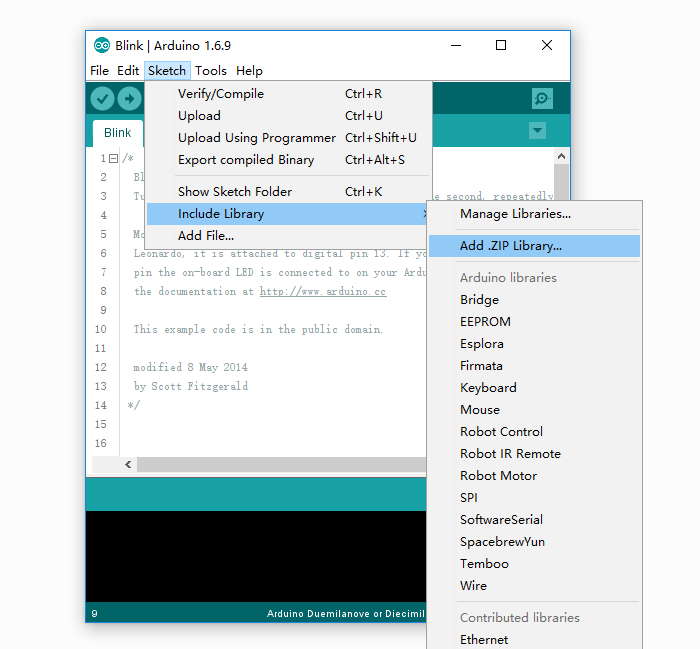
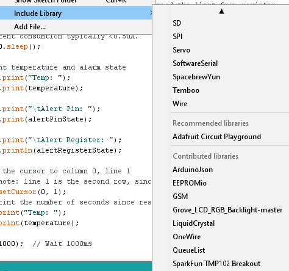
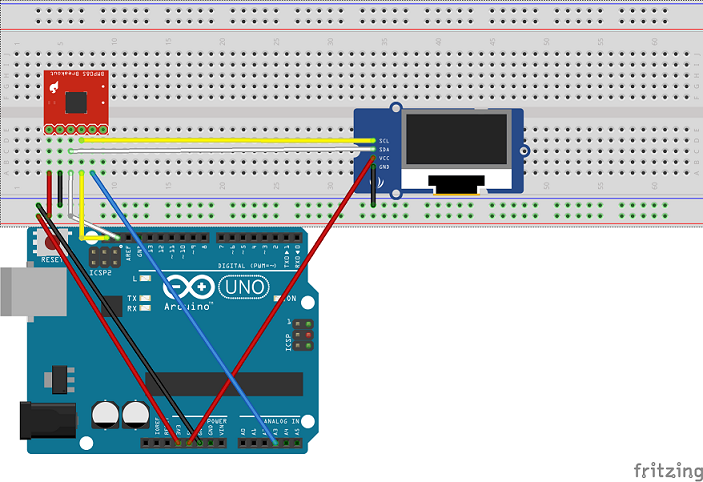

#TMP 102 Temperature Sensor Circuit

## Download librarys
Download the following libraries:

[Sparkfun TMP102 library](https://github.com/sparkfun/SparkFun_TMP102_Arduino_Library/archive/master.zip)

[Grove LCD RGB Backlight](https://github.com/Seeed-Studio/Grove_LCD_RGB_Backlight/archive/master.zip)

Both of these libraries are specific to their devices however both require I2C protocol (that's why both devices are on the same bus).
They provide nice programming abstractions that allow us to access the devices from the arduino program. 

##Install arduino libraries
- Open Arduino IDE on your laptop. 
- Click on Sketch > Include Library > Add .ZIP Library.

- Add both libraries. To check if the install was successfull, click on  Sketch > Include Library >

## Circuit

Build the following circuit:
