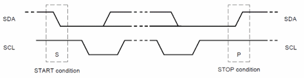
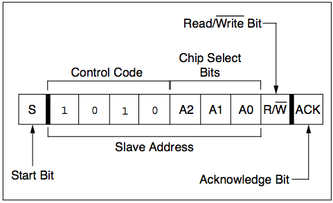

#I2C Devices
I2C (Inter-Integrated Circuit) is a short distance serial interface that requires only 2 bus lines for data transfer. You will notice in the circuit you built that both the temp sensor and the LCD display are on the same 2 wire bus connected to the Arduino board, a serial data line (SDA) and a serial clock line (SCL).
I2C is a Master/Slave protocol - only a Master can initiate a data transfer and Slaves respond to the Master. 

##Starting communication
A Start condition is issued by the Master device to inform all the slave devices that something is about to be transmitted on the bus. As a result, all connected slave devices will listen to the serial data line for instructions. The Start condition is issued by pulling the SDA line low followed by the SCL line. Once the data transfer is finished, the bus Master sends a Stop condition to inform other devices that it would like to release the bus. 


##Addressing
Each device  connected to the bus is software addressable by a unique 7-bit address. The first byte sent after the Start condition is known as Control byte. The first seven bits of the control byte make up the slave address, whereas the eighth bit (LSB) indicates Read/Write. A ‘zero’ in the LSB of the first byte indicates that the Master will write information to a selected slave. A ‘one’ in this position indicates that the Master will read data from the slave. 
Some devices have their I2C addresses fixed (e.g. the LCD). Those devices that allow the address modification(e.g. the temp sensor), typically the first four bits are fixed and the next three bits are set by hardware address pins (A0, A1, and A2) that allow the user to modify the  I2C address allowing  up to eight of the same devices to operate on the I2C bus.



## Scan for I2C devices
The following Arduino sketch scans the I2C bus for active devices. Copy and run this code on your arduino; you should detect the LCD and the sparkfun Controller.
```c
#include <Wire.h>
 
 
void setup()
{
  Wire.begin();
 
  Serial.begin(9600);
  while (!Serial);             // Leonardo: wait for serial monitor
  Serial.println("\nI2C Scanner");
}
 
 
void loop()
{
  byte error, address;
  int nDevices;
 
  Serial.println("Scanning...");
 
  nDevices = 0;
  for(address = 1; address < 127; address++ )
  {
    // The i2c_scanner uses the return value of
    // the Write.endTransmisstion to see if
    // a device did acknowledge to the address.
    Wire.beginTransmission(address);
    error = Wire.endTransmission();
 
    if (error == 0)
    {
      Serial.print("I2C device found at address 0x");
      if (address<16)
        Serial.print("0");
      Serial.print(address,HEX);
      Serial.println("  !");
 
      nDevices++;
    }
    else if (error==4)
    {
      Serial.print("Unknown error at address 0x");
      if (address<16)
        Serial.print("0");
      Serial.println(address,HEX);
    }    
  }
  if (nDevices == 0)
    Serial.println("No I2C devices found\n");
  else
    Serial.println("done\n");
 
  delay(5000);           // wait 5 seconds for next scan
}
```
Look at the code and make sure you understand what the logic is. You should see something like the following:
```
Scanning...
I2C device found at address 0x03  !
I2C device found at address 0x3E  !
I2C device found at address 0x48  !
I2C device found at address 0x62  !
I2C device found at address 0x70  !
done
```
Notice there is more than one device. Suggest why this might be the case and use the internet to prove it!