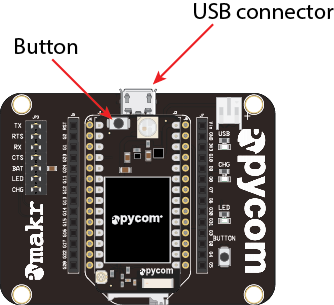
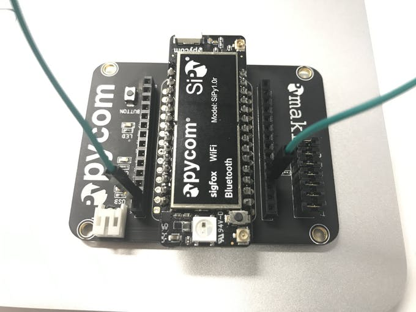
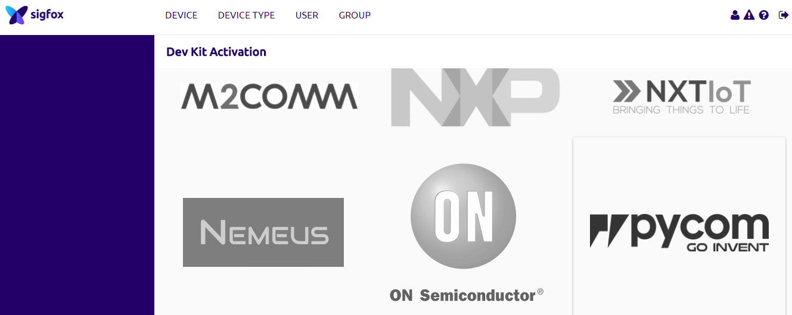

# Equipment

- Laptop
- SiPy development board
- PyCom expansion board
- MicroSD cable

## Pre-Setup Tasks

###Expansion board 
Connect the SiPy module to the Expansion Board:
- Look for the reset button on the module (located at a corner of the board, next to the LED).
- Locate the USB connector on the expansion board.
- Insert the module on the expansion board with the reset button pointing towards the USB connector. It should firmly click into place and the pins should now no longer be visible.

###PyCom Firmware Updater
Go to [Pycom update tools](https://docs.pycom.io/chapter/gettingstarted/installation/firmwaretool.html) and follow the download instructions for your particular Operating system. Install the tool annd make sure that it opens correctly.

##Put SiPy in Upgrade Mode
You will need to put the SiPy in Upgrade mode in order to obtain an ID and PAC for your SigFox Device.
Do this by connecting the G23 pin to the GND pin with a jumper wire 

##Upgrade the SiPy
Connect the SiPy in upgrade mode to your computer and run the firmware upgrade tool. 
Follow the instructions carefully
>> NOTE: MAKE SURE TO SELECT SIPY FOR THE BOARD AND EUROPE AS THE REGION. OTHERWISE YOU MAY NOT GET THE CORRECT PAC AND ID.

Completing the uprgrade should provide a new ID and PAC number for the device. Record the ID and PAC. You're ready to go... 

##Activate Device

###Sigfox backend password
Check your email, you should have recieved a mail from *backend-noreply@sigfox.com* with the topic "How to set your password".
Follow the instructions contained in the mail to set your password for the Sigfox backend.
Go to (the sigfox activation page)[https://backend.sigfox.com/activate]. You will see a list of Sigfox-enabled development kits; select Pycom for activating the SiPy.:

Now, for the country, find and select Ireland (the VT logo):
 

For Device information, enter the ID and PAC number obtained in the *Upgrade to SiPy* step. Enter the Device ID and PAC number that the Firmware Tool generated for you earlier and fill in the required information. When completed you'll receive an email from Sigfox confirming your account.

You should now be in a position to use the device on the Sigfox network.