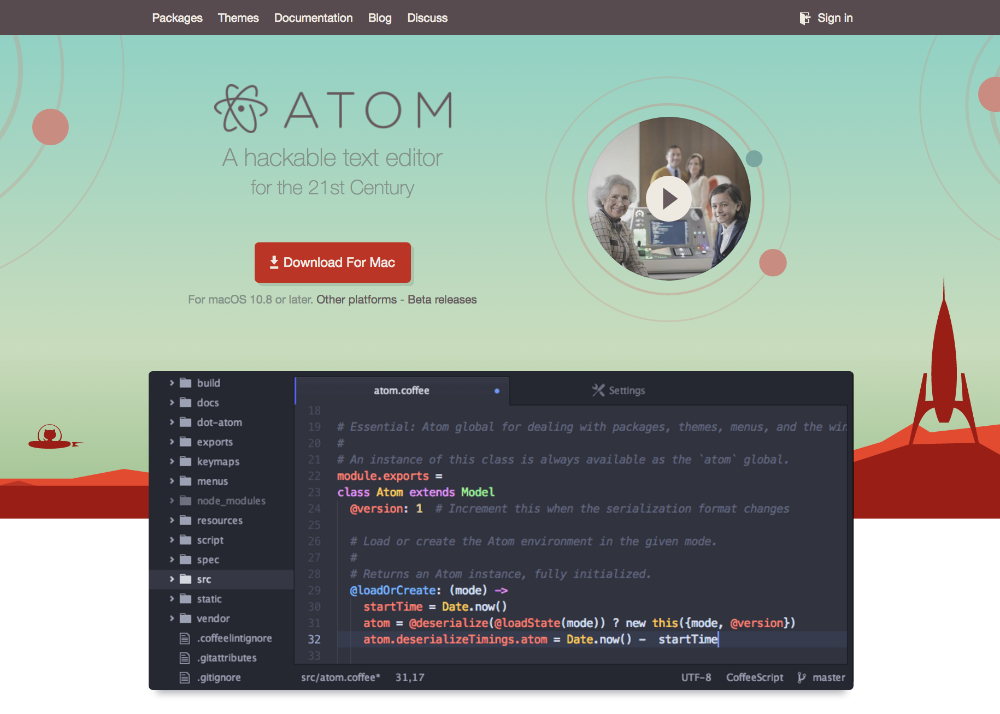

## Installing Pymakr Plugin (Atom)

Get Atom from here .

- Navigate to the Install page, via Atom > Preferences > Install
- Search for Pymakr and select the official Pycom Pymakr Plugin.
- Click the install button to download and install the Pymakr Plugin.

You should now be able to use Atom to program the SiPi

