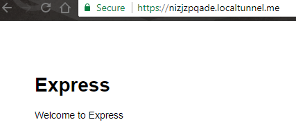

## Sigfox Callbacks

We will create a node.js server that will be called by Sigfox callbacks. This server will take the payload sent by the IOT device.

The Server will act as a "middleware". The middleware will take inbound data, check it, eventually reformat it and publish. We assume that this middleware will take only one deviceType, therefore only one callback. 

For testing and convenience, you will set up the middleware on your laptop.

### Setup

Install [locatunnel](https://localtunnel.github.io/www/):

```bash
npm install -g localtunnel
```

Run localtunnel as follows to obtain a URL
~~~bash
lt --port 3000
your url is: https://eomkvzpxzj.localtunnel.me
~~~

We will use Express application to create the middleware. Use the Express application generator tool, express-generator, to quickly create an application skeleton.
The express-generator package installs the express command-line tool. Use the following command to do so: 

```bash
npm install express-generator -g
```

To generate our application skeleton, run the following:
~~~bash
express sigfoxMiddleware
~~~
This will create a sigfoxMiddleware folder containing the skeleton app. Install dependencies and run it :

```bash
cd sigfoxMiddleware/
npm install
nodemon start
```

Now if you go to <http://localhost:3000> or <https://eomkvzpxzj.localtunnel.me> you should see :



