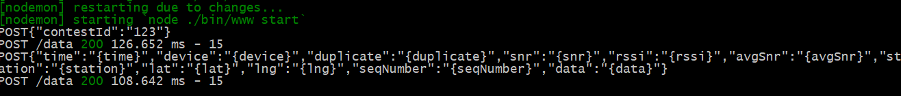

## Test the POST route

Now modify skeleton app to respond to data from Sigfox. 
We will configure Sigfox to use HTTP POST requests to the server via the </data> route.
For now we'll just ouput the request body to the console. 
Add the POST data route to 'index.js' as follows:

```javascript
/* POST data */
router.post('/data', function(req, res, next) {
    console.log("POST : " + JSON.stringify(req.body));
    res.send("Post Successful");
});
```

The server should restart automatically when any changes are detected. **However, you may need to restart localtunnel**
Now you should install a Restful client. If you use Chrome, try one of the following:
- [Postman Chrome Extension](https://chrome.google.com/webstore/detail/postman/fhbjgbiflinjbdggehcddcbncdddomop)
- [Advanced Rest Client](https://chrome.google.com/webstore/detail/advanced-rest-client/hgmloofddffdnphfgcellkdfbfbjeloo)

Check the server is working properly by submitting the following request :

```json
URL : your localtunnel url  /data/
Method POST
Header : Content-Type : application/json (if you forget this it won’t work)
Body Raw JSON :
{
	"time" : "{time}",
	"device" : "{device}",
	"duplicate" : "{duplicate}",
	"snr" : "{snr}",
	"rssi" : "{rssi}",
	"avgSnr" : "{avgSnr}",
	"station" : "{station}",
	"lat" : "{lat}",
	"lng" : "{lng}",
	"seqNumber" : "{seqNumber}",
	"data" : "{data}"
}
```

When you hit SEND you should see this in your console window :



