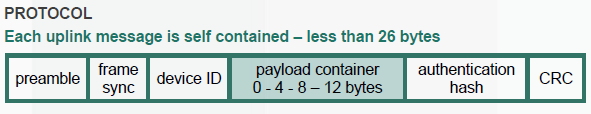
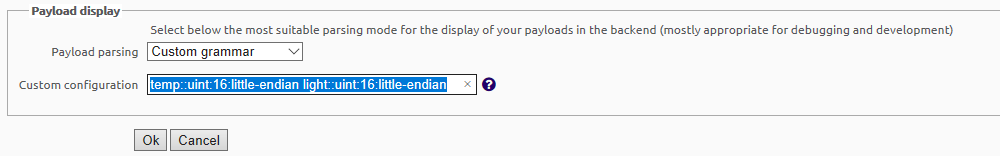
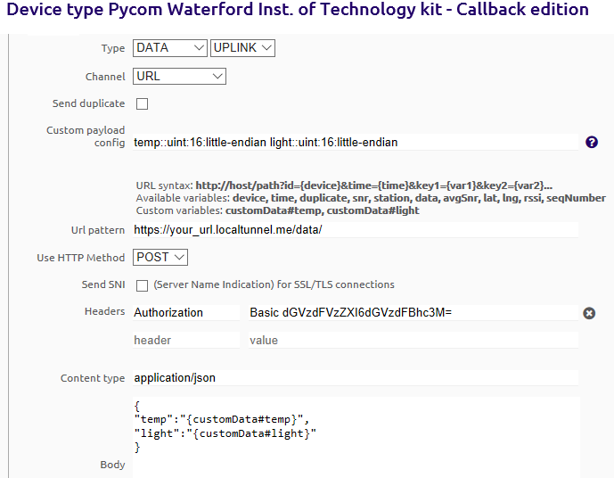

#Custom Data
As discussed in class, Sigfox packet can contain 12 bytes of data.

In order to make optimal use of this payload, it is worth examinint the byte requirements of each data item(or signal) you wish to transmit.
For this part of the experiment, we will use the Pycom [Pysense](https://pycom.io/product/pysense/)  expansion board to provide sensor data. In the absence of this you can use hard coded data or connect analog sensors connected to the regular expansion board. 

####Convering to byte array. 
Up to now we have sent data in ascii format, with each character repersented by a one byte. This is not efficient for telemetry in numerical format. 
In this example we will retrieve two sensor values from the pysense expansion board, temperature and light intensity.
However you can skip the next step by substituting the sensor output for simulated values.
##Setting up Pycom Sensor expansion board:
Follow the instructions [here](https://docs.pycom.io/chapter/pytrackpysense/) to install the latest firmware and transfer the nessesary libraries to the PySense board.
You can connect it to your laptop in the same way as the regular expansion board.
We will use temperature and light sensor values.

##Update code
If you're using the PySense board, the following code will send the temperature and light sensors. 
You have only 12 bytes of data in the payload. The values we receive from the sensors are specified in the associated spec sheets. For example, the light sensor returns a 16 bit value. 
For our purposes here, we will put the temperature value in the first 2 bytes and the light sensor in the next 2 bytes. The following code constructs a byte array using the temperature and light values. 

~~~python
from pysense import Pysense

from SI7006A20 import SI7006A20

from LTR329ALS01 import LTR329ALS01

import time
from network import Sigfox
import socket

py = Pysense()

si = SI7006A20(py)

lt = LTR329ALS01(py)

# init Sigfox for RCZ1 (Europe)
sigfox = Sigfox(mode=Sigfox.SIGFOX, rcz=Sigfox.RCZ1)

# create a Sigfox socket
s = socket.socket(socket.AF_SIGFOX, socket.SOCK_RAW)

# make the socket blocking
s.setblocking(True)

# configure it as uplink only
s.setsockopt(socket.SOL_SIGFOX, socket.SO_RX, False)

#send temp and light every 30 seconds
while True:
    temperature = int(round(si.temperature()*100)) #send temp as rounded integer * 100
    light = lt.light()[0]  #light 
    print(str(temperature) + ":"+str(light))
    messageBytes=bytes((temperature & 0xff, ((temperature >> 8) & 0xff),light & 0xff, ((light >> 8) & 0xff)))
    s.send(messageBytes)
    time.sleep(30)
~~~

If you don't have the PySense board, the following code will generate hard coded values in the same range. 

~~~python
from pysense import Pysense
import time
from network import Sigfox
import socket

py = Pysense()

# init Sigfox for RCZ1 (Europe)
sigfox = Sigfox(mode=Sigfox.SIGFOX, rcz=Sigfox.RCZ1)

# create a Sigfox socket
s = socket.socket(socket.AF_SIGFOX, socket.SOCK_RAW)

# make the socket blocking
s.setblocking(True)

# configure it as uplink only
s.setsockopt(socket.SOL_SIGFOX, socket.SO_RX, False)

while True:
    #temperature = int(round(si.temperature()*100))
    temperature = 24
    light = 350
    print(str(temperature) + ":"+str(light))
    messageBytes=bytes((temperature & 0xff, ((temperature >> 8) & 0xff),light & 0xff, ((light >> 8) & 0xff)))
    s.send(messageBytes)
    time.sleep(30)
~~~

Run the code on the Pycom boards. Log into the sigfox backend and check the values appear.

###Sigfox Back End

To configure the back end to display the values correctly, go to the "Device Type" tab and choose the "Pycom Kit". You'll be presented with an information screen and in the top right corner, you'll find an "Edit" button. Under "Display", you can choose "Custom Grammar" to set custom configuration to "temp::uint:16:little-endian light::uint:16:little-endian"; this will turn your messy hexadecimal message into a more readable message.

Now, update the callback as follows to encode the data properly. For this you will change the   to discribe the structure of your message. Go to the "Device Type" tab and choose the "Pycom Kit". Select CallBacks and click edit. Change the config as follows: 

Now start your Node.js middleware - you should see the temp and light values begin to appear in your MongoDB.

###Update Middleware Validation

Now update the validator code in the */routes/index.js* to validate the temperature and light data:

~~~javascript
...
req.checkBody("temp", "Did not recieve valid data").notEmpty().isInt();
req.checkBody("light", "Did not recieve valid data").notEmpty().isInt();
...
~~~

