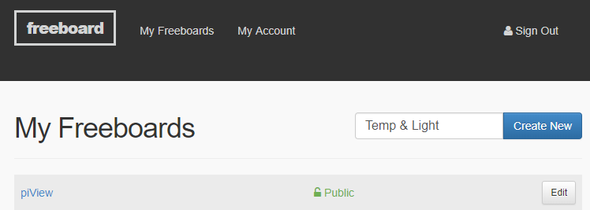
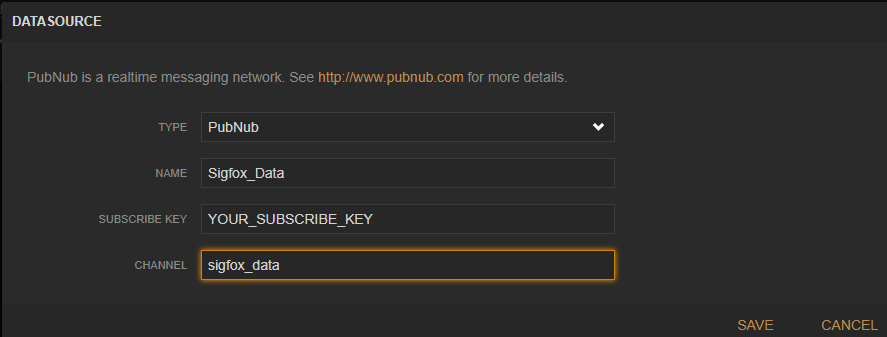
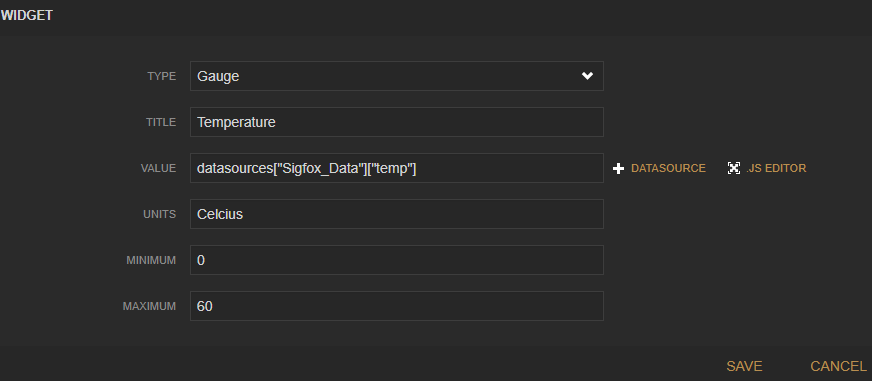
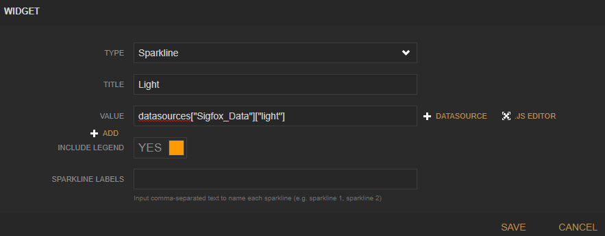
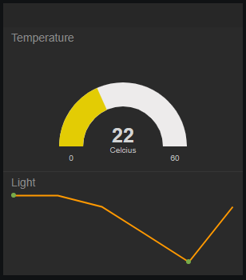

#Dashboard

Now that you have a functioning publish-subscribe service, we should create an app that can visualise/analyse the data. 
There are a couple of solutions available to perform IoT analytics data:

- [Thingsboard](https://thingsboard.io/)
- [Thingspeak](https://thingspeak.com/)
- [Freeboard](https://freeboard.io/)

In this exercise we'll have a look at freeboard as it's simple to set up and it connects to PubNub services "out of the box".

##Freeboard

Freeboard is a browser-based Dashboarding solution for devices and IoT data. Begin by creating an account on [Freeboard](https://freeboard.io/).  
Once you've completed registration, you can start creating dashboards. 

###Temp & Light Board

In this case, you will create a small dashboard that displays temperature and light data published from your device. In the right hand of the screen, enter "Temp and Light" in the name box and click the New button to display the empty board.

In Datasources, add the following datasource:

Select the "Add Pane" and, in the pane,  click "+" add a guage widget with the following settings:

Now click "+" add a Sparkline widget with the following settings:

Now start your Express Middleware/local tunnel server and start generating data from your device. You should start to see the data being visualised on the dash:

