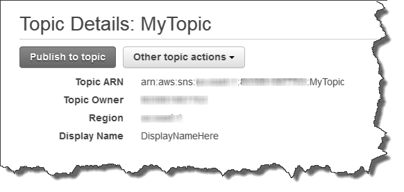
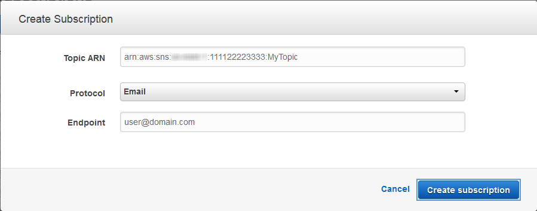

# Create AWS Simple Notification Service Topic

Now that you're signed up for Amazon SNS, you're ready to create a topic. A topic is a communication channel to send messages and subscribe to notifications. It provides an access point for publishers and subscribers to communicate with each other. In this section you create a topic named _MyTopic_.

##Create a new Topic

1.  In the [Amazon SNS console](https://console.aws.amazon.com/sns/v2/home), click **Create topic**.

    The **Create topic** dialog box appears.

2.  In the **Topic name** box, type the topic name **sigfox**

3.  Click **Create topic**.

    The new topic appears in the **Topics** page.

4.  Select the new topic and then click the topic ARN.

    The **Topic Details** page appears.

   

5.  Copy the topic **ARN** for the next task.

## Subscribe to Sigfox Topic

To receive messages published to a topic, you have to subscribe an endpoint to that topic. An endpoint is a mobile app, web server, email address, or an Amazon SQS queue that can receive notification messages from Amazon SNS. Once you subscribe an endpoint to a topic and the subscription is confirmed, the endpoint will receive all messages published to that topic.

In this section you subscribe an endpoint to the topic you just created in the previous section. You configure the subscription to send the topic messages to your email account.

**To subscribe to a topic**

1.  Open the Amazon SNS console at [https://console.aws.amazon.com/sns/v2/home](https://console.aws.amazon.com/sns/v2/home).

2.  Click **Create subscription**.

    The **Create Subscription** dialog box appears.

3.  In the **Topic ARN** field, paste the topic ARN you created in the previous task, for example: `arn:aws:sns:eu-west-1:111122223333:MyTopic`.

4.  In the **Protocol** drop-down box, select **Email**.

5.  In the **Endpoint** box, type an email address you can use to receive the notification.

    

    Important

    Entourage Users: Entourage strips out the confirmation URL. Type an email address you can access in a different email application.

    

6.  Click **Create subscription**.

    

7.  Go to your email application and open the message from AWS Notifications, and then click the link to confirm your subscription.

    Your web browser displays a confirmation response from Amazon SNS.

