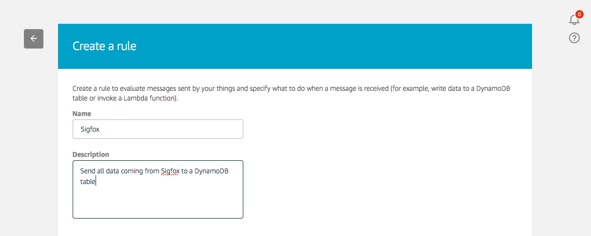
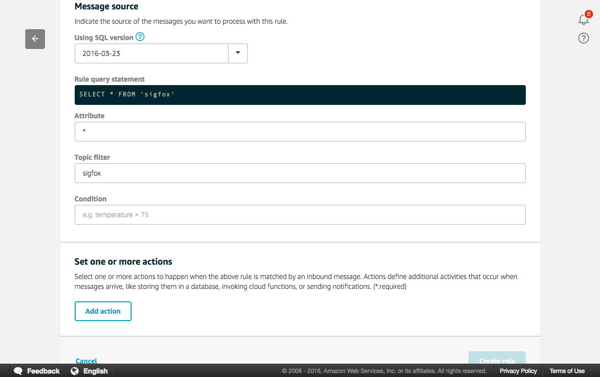

# Add IoT Rule

Now, go to the AWS IoT console and create a new rule.

Now we will send every message payload coming from Sigfox in its entirety to the SNS topic.Use  “sigfox” as the topic filter, and no conditions.

Next add an action, select “Send Message as SNS push Notification”.

Select the SNS topic you created previously. In the SNS target select your topic and set the message format as "raw". Finally, create a new role by clicking on the “Create a new role” button. Name it “SNSsigfox” and click again on the “Create a new role”, you can now select it in the drop-down list. Thanks to this IAM role, AWS IoT can push data on your behalf to the SNS topic using the proper permissions.

Add the action to the rule and create the rule. You should now be able to visualize the newly created rule in the AWS Console.

The final step is to go to your email and observe the messages from the SNS push.

Using this example’s basic flow, you can now create other AWS IoT rules that route the data to other AWS services. You might want to perform archiving, analytics, machine learning, monitoring, alerting and other functions. 